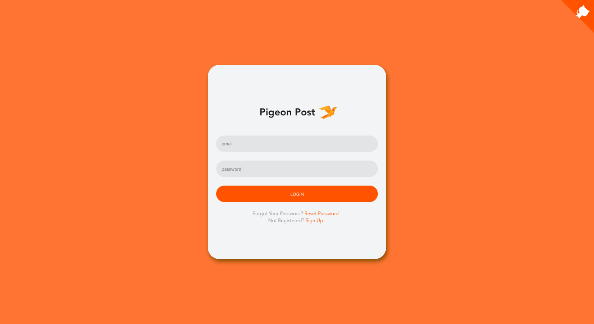
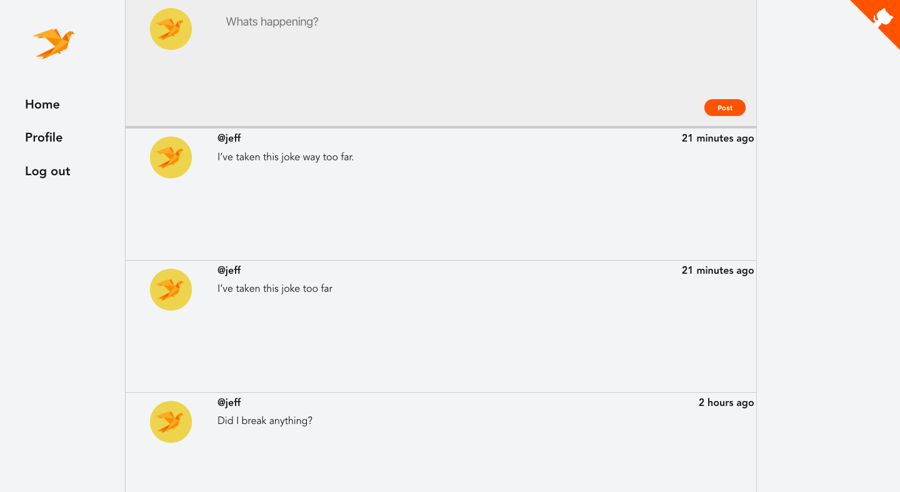
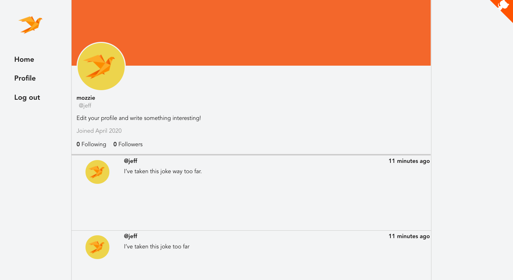

# Pigeon Post

This is a simple web app created using `Vue` to mimic basic design and functionality of the official Twitter app with a humerous twist on the delivery of content. Posts deliver in pigeon time, meaning posts take between 3 to 7 days be delivered.

The backend uses `Firebase` and `Cloud Firestore` to run a server for the application. Since this is a demo, there is cap on the number of interactions with the backend. Play nice :(

## Demo

## Screenshots

## Dependencies

- vue
- vue-router
- vuex
- firebase
- lax.js for scrolling animations
- moment for date/time manipulation
